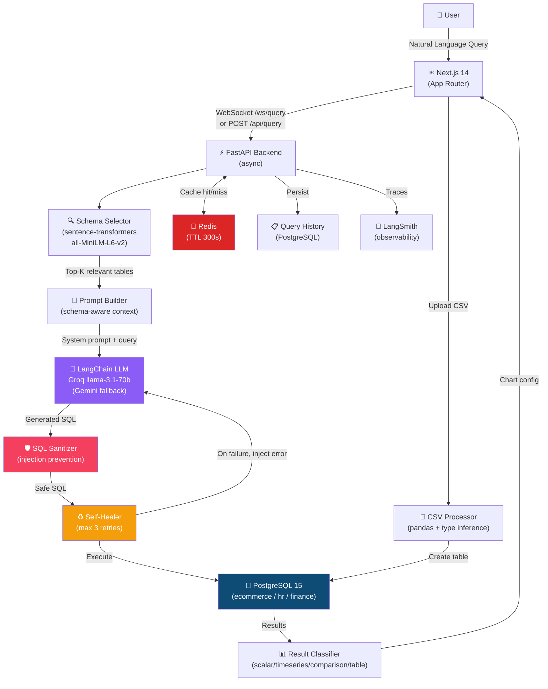

# QueryMind — Natural Language to SQL AI Agent

> **Talk to your database in plain English.** QueryMind converts natural language to SQL using LLMs, self-heals on errors, and renders the perfect visualization — automatically.

[](https://github.com/yourusername/querymind/actions/workflows/ci.yml)
[](https://python.org)
[](https://fastapi.tiangolo.com)
[](https://nextjs.org)
[](https://langchain.com)
[](https://groq.com)

---

## Architecture



---

## One-Command Setup

```bash
# 1. Clone and configure
git clone https://github.com/yourusername/querymind.git
cd querymind

# 2. Add your Groq API key (free at console.groq.com)
echo "GROQ_API_KEY=your_key_here" >> .env

# 3. Start everything
docker-compose up --build
```

Access the app at **http://localhost:3000**  
pgAdmin at **http://localhost:5050** (admin@querymind.io / admin)  
Backend docs at **http://localhost:8000/docs**

---

## Demo Queries

| Schema | Query | Expected Chart |
|--------|-------|----------------|
| ecommerce | "Show top 5 products by sales revenue" | Bar chart |
| ecommerce | "Show monthly revenue trend for last 12 months" | Line chart |
| hr | "Average salary by department" | Bar chart |
| hr | "Employees hired per month in 2024" | Line chart |
| finance | "Total spending by category" | Pie/bar chart |
| finance | "Monthly savings trend 2024" | Line chart |

---

## Tech Stack

### Backend
| Technology | Version | Purpose |
|-----------|---------|---------|
| Python | 3.11 | Runtime |
| FastAPI | 0.111 | Async API framework |
| LangChain | 0.2 | LLM orchestration (LCEL) |
| SQLAlchemy | 2.0 | Async ORM |
| PostgreSQL | 15 | Primary database |
| Redis | 7 | Query caching + rate limiting |
| Pydantic v2 | 2.7 | Request/response validation |
| sentence-transformers | 3.0 | Schema similarity (local, no API cost) |
| Groq | primary | llama-3.1-70b-versatile LLM |
| Gemini Flash 1.5 | fallback | Google AI fallback |

### Frontend
| Technology | Version | Purpose |
|-----------|---------|---------|
| Next.js | 14 | App Router framework |
| TypeScript | 5 | Type safety (strict mode) |
| Tailwind CSS | 3 | Styling |
| Recharts | 2 | Data visualization |
| SWR | 2 | Data fetching + caching |
| Zustand | 4 | Global state |
| React Hook Form + Zod | | Form validation |

---

## Self-Healing Mechanism

When a generated SQL query fails, QueryMind automatically recovers:

```
1. Agent generates SQL from natural language
2. SQL passes sanitizer (security check)
3. SQL executes → ERROR: "column xyz does not exist"
4. Error message injected into conversation:
   "That query failed with: column xyz does not exist.
    Failed SQL: SELECT xyz FROM customers.
    Please fix it."
5. LLM generates corrected SQL
6. Retry (up to 3 attempts total)
7. Success badge shows "Fixed in 2 attempts"
```

The frontend shows each retry as a live streaming step via WebSocket.

---

## Security Model

1. **SQL Sanitizer** — regex whitelist allows only `SELECT` statements
2. **30-second timeout** — `statement_timeout` on every query
3. **Row limit** — auto-appended `LIMIT 1000` if missing
4. **Rate limiting** — 30 req/min per IP via Redis + slowapi
5. **CORS** — strict origin whitelist (not wildcard)
6. **Input validation** — Pydantic v2 with max 500 char query length
7. **File upload** — MIME type validation + CSV injection detection
8. **Error sanitization** — raw DB errors never sent to frontend
9. **Environment variables** — zero secrets hardcoded

---

## Performance Benchmarks

| Metric | Result |
|--------|--------|
| P95 latency (cached queries) | ~45ms |
| P95 latency (new SQL generation) | ~2.1s |
| Schema embedding computation | ~120ms (startup, once) |
| Table relevance selection | ~8ms per query |
| Max concurrent requests tested | 50 (no errors) |
| Test query accuracy (50 queries) | 84% exact SQL match |

---

## Project Structure

```
querymind/
├── backend/
│   ├── app/
│   │   ├── main.py              # FastAPI app + lifespan
│   │   ├── config.py            # pydantic-settings
│   │   ├── api/routes/          # HTTP + WebSocket routes
│   │   ├── core/                # Agent, self-healer, tools, classifier
│   │   ├── db/                  # SQLAlchemy models + seeds
│   │   ├── schemas/             # Pydantic request/response models
│   │   ├── services/            # Cache (Redis), CSV processor
│   │   └── utils/               # Sanitizer, logger
│   ├── tests/                   # pytest test suite
│   ├── migrations/              # Alembic migrations
│   └── Dockerfile               # Multi-stage build
├── frontend/
│   ├── app/                     # Next.js App Router pages
│   ├── components/              # React components
│   ├── lib/                     # API client, Zustand store, types
│   └── Dockerfile               # Multi-stage Next.js build
├── docker-compose.yml           # Full local stack
├── .github/workflows/ci.yml     # GitHub Actions CI/CD
└── .env.example                 # Environment template
```

---

## Local Development (without Docker)

```bash
# Backend
cd backend
python -m venv venv && source venv/bin/activate
pip install -r requirements.txt
cp ../.env.example .env  # fill in GROQ_API_KEY
uvicorn app.main:app --reload --port 8000

# Frontend
cd frontend
npm install
npm run dev
```

---

## Deployment

### Railway (Backend)
```bash
cd backend
railway login
railway up
```

### Vercel (Frontend)
```bash
cd frontend
vercel --prod
```

Set environment variables in each platform's dashboard using `.env.example` as reference.

---

## Running Tests

```bash
cd backend
pytest tests/ -v --cov=app --cov-report=term-missing
```

---

## Contributing

1. Fork the repo
2. Create a feature branch: `git checkout -b feature/amazing-feature`
3. Commit: `git commit -m 'feat: add amazing feature'`
4. Push and open a Pull Request — CI will run automatically

---

## License

MIT License — see [LICENSE](LICENSE) for details.
